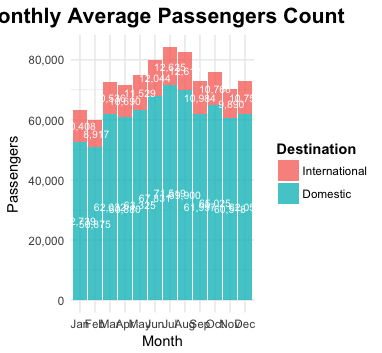
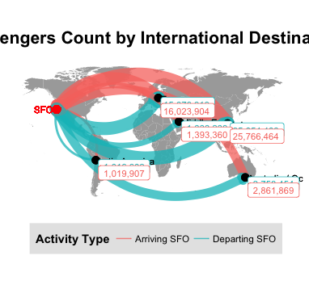
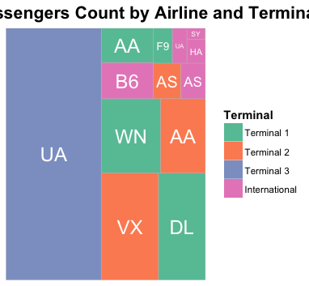
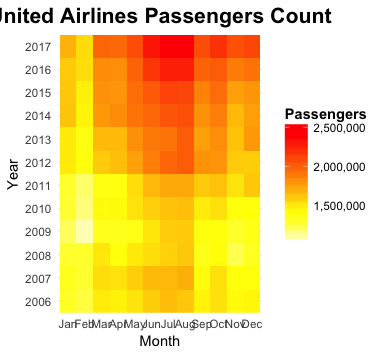

# USF BSDS 100: Intro to Data Science with R
Case Study: Air Traffic Passenger Statistics

## Team Members
* Jacques Sham ([@jacquessham](https://github.com/jacquessham))
* Charles Siu ([@chunheisiu](https://github.com/chunheisiu))

## Introduction
The goal of this project is to visualize the data from SFO operation to understand the passenger and airplane traffic in SFO. The project is done in R with ggplot for making all the visualization.  
The data set is an open source data set obtained from DataSF 
<a href="https://datasf.org/opendata/">Open SF</a>
 
And we can find the data dictionary [here](DataSF_Data_Dictionary_for_Air_Traffic_Passenger_Statistics.pdf)
 
The data set consists of 12 columns, 
the columns indicates the destination/origin with passenger counts the airline carry each month. 
As well as, the price type and boarding area of the airlines. 
 
In the given period, there are 17,959 observations.

## Procedures and Result
First, we did some data cleansing before making visualization because there were inconsistent and incorrect data entries. 
Then, we use ggplot to visualize the data in: 
1 - Bar Chart 
 
2 - World Map 
 
3 - Pie Chart 
4 - Line Chart 
5 - Stacked Line Chart 
 
6 - Tree Map 
 
7 - Heatmap 
 
 
The R markdown code could be found here: [R markdown code](CaseStudy.Rmd) 
And as well as the output in [HTML](CaseStudy.html) and [PDF](CaseStudy.pdf) 
Finally, the powerpoint slides for presentation is [here](CaseStudy_Sham_Siu.pdf) 
