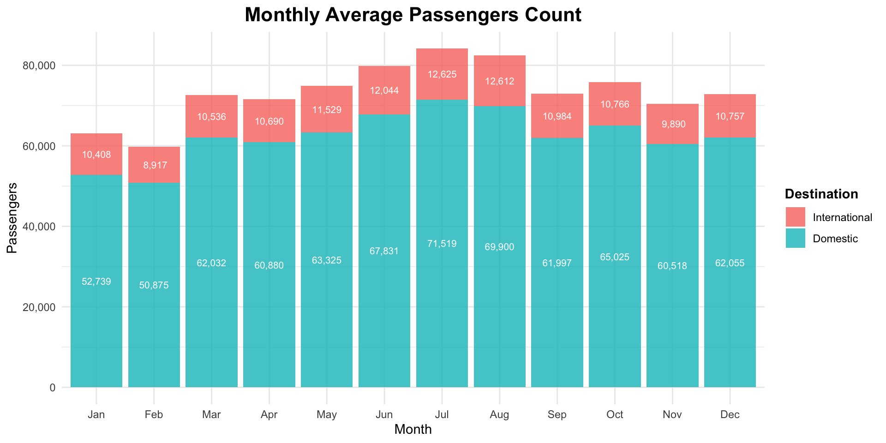
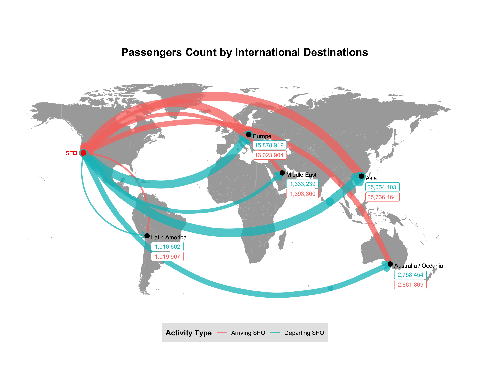
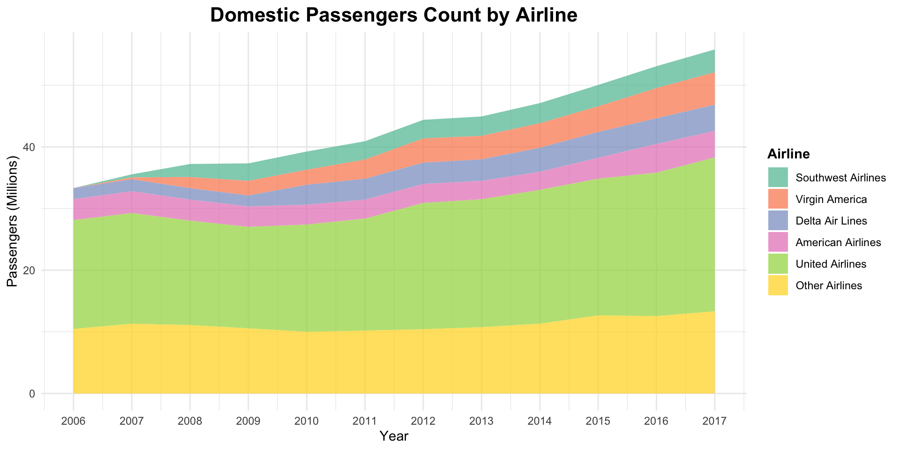
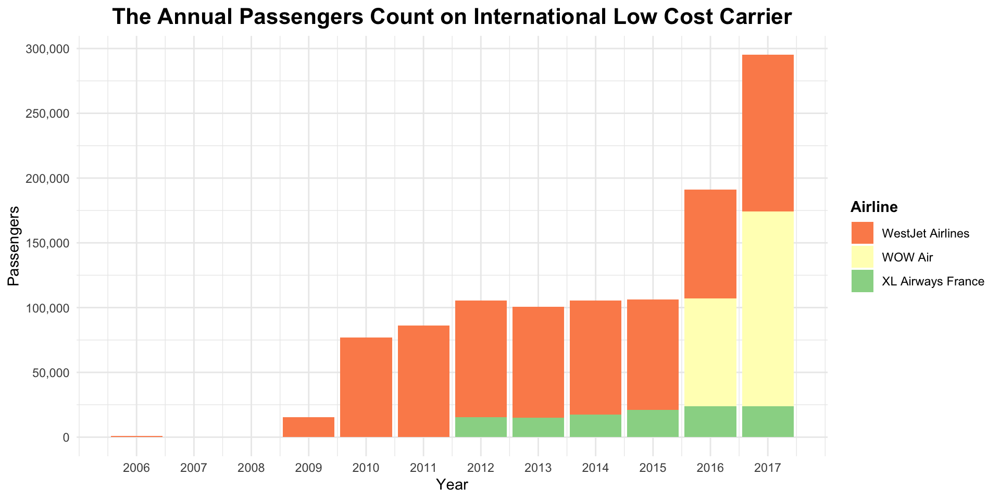
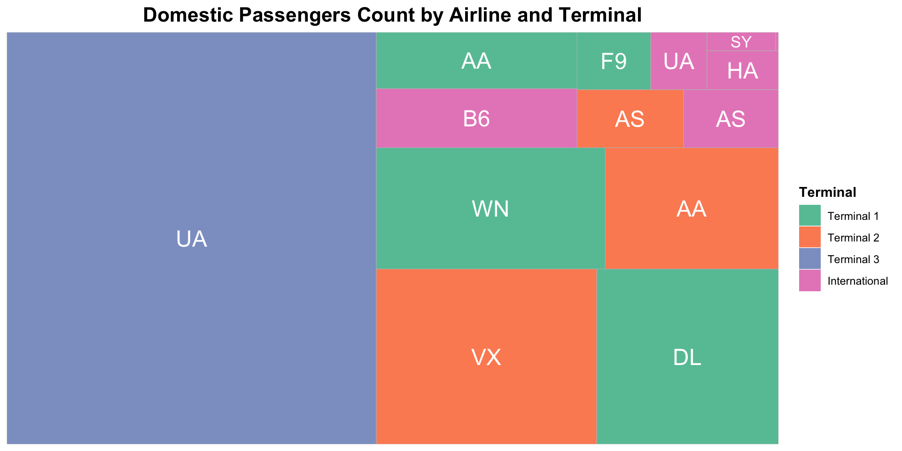
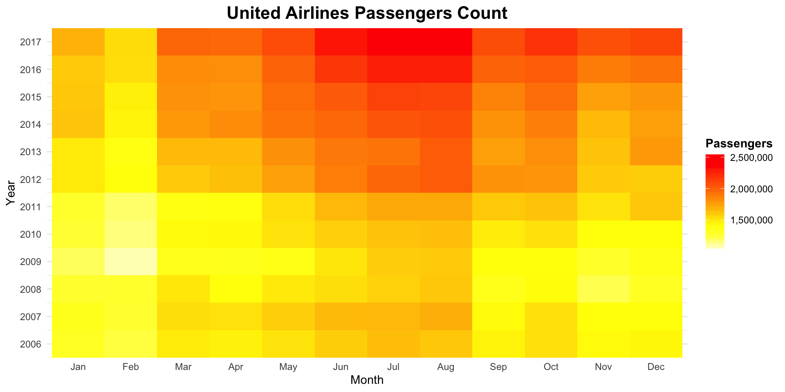

## USF BSDS 100: Intro to Data Science with R
Case Study: Air Traffic Passenger Statistics

###### Team Members
* Jacques Sham ([@jacquessham](https://github.com/jacquessham))
* Charles Siu ([@chunheisiu](https://github.com/chunheisiu))

### Introduction
The project visualizes various passenger statistics of San Francisco International Airport (SFO), using the dataset published by the SF Airport Commission through DataSF. It utilizes R for scripting and ggplot for visualization. It is part of the coursework for BSDS 100 Intro to Data Science with R class at University of San Francisco.

The dataset we sourced from DataSF includes destination, origin, airlines, terminals, and passenger count between July 2005 and December 2017. The dataset contains 17,959 rows and 12 columns. The dataset is available [here](https://data.sfgov.org/Transportation/Air-Traffic-Passenger-Statistics/rkru-6vcg) and the data dictionary is available [here](DataSF_Data_Dictionary_for_Air_Traffic_Passenger_Statistics.pdf).

### Procedures
For the purpose of the project, we performed data cleansing to fix incorrect and inconsistent data entries. After that, we created a few visualizations using `ggplot` that aims to provide insights for the following about SFO:

1. Average monthly passengers traffic between 2006 and 2017
2. Passengers traffic by destination/origin regions
3. Overview on passengers traffic by domestic airlines
4. Passengers traffic traveled by Low Cost Carrier
5. Passengers traffic in airport terminals
6. Passengers traffic on 1 selected domestic carrier

### Visualizations
- Bar Chart: Monthly Average Passenger Traffic between 2006 and 2017  

- World Map: Passenger Traffic by International Destinations  

- Stacked Line Chart: Domestic Passenger Traffic by Airline  

- Stacked Bar Chart: Annual Passenger Traffic on International Low Cost Carriers  

- Tree Map: Domestic Passenger Traffic of Airline and Terminal  

- Heatmap: Passenger Traffic of United Airlines  

The detailed version of the report could be viewed in [PDF Version](CaseStudy.pdf) format. Additionally, the `rmd` source code is available [here](CaseStudy.Rmd) and the presentation slides are available [here](CaseStudy_Sham_Siu.pdf).
